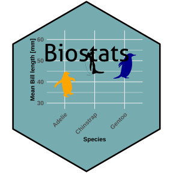

[](https://doi.org/10.5281/zenodo.14671306)



# Biostats

This application provides a user-friendly interface for conducting basic data wrangling, correlation tests, assumption tests (Shapiro-Wilk, Levene's test, QQ plots, etc.), various statistical tests (t-test, ANOVA, Kruskal-Wallis test, Tukey HSD, etc.), and visualizing data using ggplot2.

## Features

- Data Wrangling: Easily import, filter, transform, and clean your datasets.
- Correlation Tests: Explore relationships between variables with correlation tests.
- Assumption Tests: Assess the assumptions of normality, homogeneity of variances, and other assumptionsnecessary 	  for statistical tests.
 - Statistical Tests: Conduct a variety of statistical tests including t-tests, ANOVA, Kruskal-Wallis tests,     andmore.
- Data Visualization: Visualize your data using ggplot2, including boxplots, point plots, line plots, andsmoothing  with annotations.


## Local version

#### Step 1: Install R

##### Linux (Ubuntu)
```bash
sudo apt update
sudo apt install -y r-base
```
Verify installation:
```bash
R --version
```

##### Windows/Mac
- Download R from [CRAN](https://cran.r-project.org/).
- Follow the installer instructions.

#### Step 2: Install RStudio
1. Download RStudio Desktop (free version) from [RStudio's website](https://posit.co/download/rstudio-desktop/).
2. Install it by following the installation steps for your operating system.

#### Step 3: Install `remotes` for GitHub Packages
1. Open R or RStudio.
2. Install the `remotes` package:
```R
install.packages("remotes")
```

#### Step 4: Install a Package from GitHub
1. Load the `remotes` library:
```R
library(remotes)
```
2. Use the `install_github` function to install the package "COMELN".
```R
remotes::install_github("ComPlat/Biostats", subdir = "comeln")
remotes::install_github("ComPlat/Biostats", subdir = "bs")
```

3. Restart R/RStudio and start the app

```R
Sys.setenv(RUN_MODE = "BROWSER")
app <- bs::app()
shiny::shinyApp(app$ui, app$server)
```

